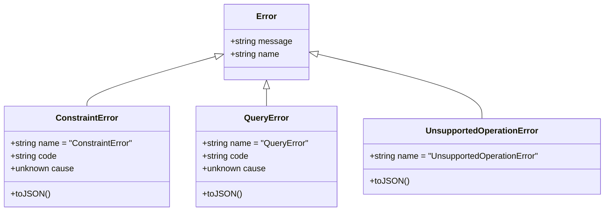

# E Core Error Taxonomy & Contract Specification

This document defines the canonical error contract for `@vxnus/e` and all engine implementations (`InMemoryEngine`, `SqliteEngine`, `PostgresEngine`).

---

## 1. Error Taxonomy

The E runtime provides three standard, machine-inspectable error classes exported from `@vxnus/e`:

### 1.1 `QueryError`
Thrown when a query request is malformed, structurally invalid, or contains out-of-domain parameters:
- Root `request` is `null` or non-object.
- Search query payload is non-object.
- `search.limit` is negative or non-integer.
- `traverse.maxDepth` is not an integer in $[0, 100]$.
- `traverse.maxPaths` is not an integer in $[0, 100000]$.
- `findRelations` is invoked without both `subjectId` and `objectId`.
- Exceeds maximum query string length constraints.

### 1.2 `UnsupportedOperationError`
Thrown when a request asks for a feature not implemented or not advertised by the provider's capabilities:
- Unknown `request.type` (e.g. unknown query discriminator).
- Unsupported `search.mode` (e.g. `"semantic"` or `"hybrid"` on engines where capability flag is `false`).

### 1.3 `ConstraintError`
Thrown when a mutation violates schema or integrity rules:
- Duplicate primary key (`id`).
- Foreign key violation (`entityId`, `subjectId`, `objectId` referencing nonexistent entities).
- Check constraint violation (e.g. invalid `Claim.confidence` enum).
- Not-null constraint violation on mandatory fields.

---

## 2. Distinguishing Error Types from Not-Found Semantics

An essential principle of the E runtime is:
> **Absence of data is NOT an exceptional condition. Malformed requests ARE.**

| Scenario | Input | Expected Engine Behavior | Return Class / Code |
|---|---|---|---|
| Nonexistent Entity ID | `{ type: "getEntity", id: "missing" }` | Returns `{ entities: [] }` | No Error |
| Nonexistent Alias | `{ type: "resolve", alias: "missing" }` | Returns `{ entities: [] }` | No Error |
| Nonexistent Relation Endpoints | `{ type: "findRelations", subjectId: "missing" }` | Returns `{ relations: [], entities: [] }` | No Error |
| Nonexistent Claims / Documents | `{ type: "findClaims", entityId: "missing" }` | Returns `{ claims: [] }` | No Error |
| Traversal from Nonexistent Entity | `{ type: "traverse", startId: "missing" }` | Returns `{ traversal: { entities: [], relations: [], paths: [] } }` | No Error |
| Traversal with Invalid Parameter | `{ type: "traverse", startId: "missing", maxDepth: -1 }` | **Throws `QueryError`** | `QueryError` |
| Malformed Query Root | `null` | **Throws `QueryError`** | `QueryError` |
| Unknown Query Type | `{ type: "unknownType" }` | **Throws `UnsupportedOperationError`** | `UnsupportedOperationError` |
| Duplicate ID Mutation | `insertEntity` duplicate ID | **Throws `ConstraintError`** | `ConstraintError` |
| Orphan Foreign Key Mutation | `insertAlias` with missing entity | **Throws `ConstraintError`** | `ConstraintError` |

---

## 3. Validation Ordering Invariant

### Canonical Rule:
**Structural parameter validation occurs BEFORE database lookups or existence checks.**

If a caller provides `maxDepth: -1` in a traversal query, the engine throws `QueryError("Invalid maxDepth...")` immediately across all backends, regardless of whether `startId` exists in storage.

---

## 4. Adapter Error Encapsulation & Database Outages

Database adapters (`SqliteEngine`, `PostgresEngine`) translate internal driver exceptions at the adapter boundary:
- SQLite `SQLITE_CONSTRAINT_*` and PostgreSQL error codes (`23505`, `23503`, `23514`, `23502`) are normalized into `ConstraintError`.
- Generic SQL syntax errors are wrapped into `QueryError` while preserving the driver error in `error.cause`.
- Network/connection pool outages from the driver are rethrown or wrapped preserving causality, without masking them as user input errors (`ConstraintError` / `QueryError`).
